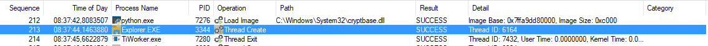
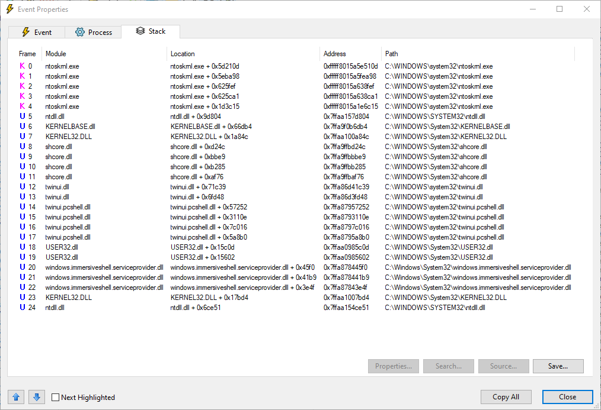
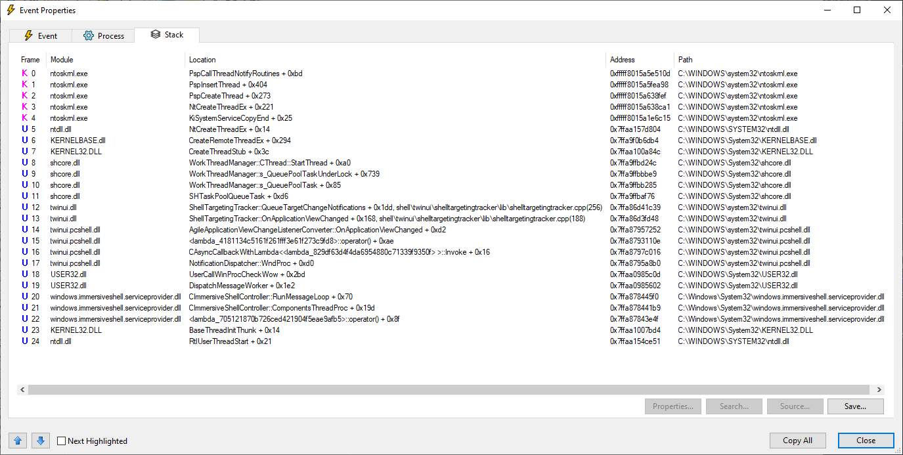

# Resolving Stack Traces With `procmon-parser`

## Limitations and Constraints

Symbolic stack trace resolution has the following limitations:

* It is based on Windows libraries, thus it is only available on **Windows** systems.
* It requires an Internet connection.
* It connects and download files from a Microsoft Server.
  - By doing so, it requires you to accept Microsoft License terms. 

## Basics 

All events in a ProcMon trace have a [stack trace](https://en.wikipedia.org/wiki/Stack_trace). 

Below is an example of an event in a ProcMon capture:



The event captured is a thread creation in `explorer.exe`.

If you double-click the event, you are brought to a new window with 3 tabs, the interesting one in our case being the 
stack trace tab. Below is an example of the aforementioned event with an **unresolved** stack trace:



And the same event with a **resolved** stack trace:



In the above pictures, after symbolic resolution of the addresses, the latter were resolved to their function names and 
offsets and sometimes the source code position where the call happens (frames 12 and 13).

Stack Traces are composed of frames (there are 25 frames in the above example), and is read from bottom to top: the 
oldest call happens at the bottom and goes to the top, traversing all the frames in-between. Once the top function 
returns, all the frames are unstacked and eventually the code flow goes back to the first frame (at the bottom).

## Resolving a Stack Trace with `procmon-parser`

Resolving a stack trace in `procmon-parser` can be as simple as follows:

```python
#!/usr/bin/env python3
# -*- coding:utf-8 -*-
import pathlib
import sys

from procmon_parser import ProcmonLogsReader, SymbolResolver, StackTraceInformation

def main():
    log_file = pathlib.Path(r"c:\temp\Logfile.PML")

    with log_file.open("rb") as f:
        procmon_reader = ProcmonLogsReader(f)
        symbol_resolver = SymbolResolver(procmon_reader)
        for idx, event in enumerate(procmon_reader):
            if idx == 213:
                frames = list(symbol_resolver.resolve_stack_trace(event))
                print(StackTraceInformation.prettify(frames))

if __name__ == "__main__":
    sys.exit(main())
```

## Setting Up Stack Trace Resolution In `procmon-parser`

### Obtaining Required Windows Libraries

Stack trace resolution uses 2 Windows DLLs:

* `dbghelp.dll` ([official documentation](https://learn.microsoft.com/en-us/windows/win32/debug/debug-help-library))
    - Provide symbol resolution functionalities. 
* `symsrv.dll` ([official documentation](https://learn.microsoft.com/en-us/windows/win32/debug/using-symsrv))
    - Symbol file management (mostly downloading symbolic information from a symbol store).

While `dbghelp.dll` is provided with Windows systems (it's located in `%WINDIR%\system32`) this DLL might be out of date
on some systems and thus missing various functionalities (as [explained here](https://learn.microsoft.com/en-us/windows/win32/debug/dbghelp-versions)). 
`symsrv.dll`, on the other hand, does not ship with Windows systems.

Both DLLs can be acquired from various Microsoft products, notably:

* [Debugging Tools for Windows](https://learn.microsoft.com/en-us/windows-hardware/drivers/debugger/)
* [Windbg Preview](https://apps.microsoft.com/store/detail/windbg-preview/9PGJGD53TN86)
* [Visual Studio](https://visualstudio.microsoft.com/downloads/)

The official and [**recommended way**](https://learn.microsoft.com/en-us/windows/win32/debug/dbghelp-versions) is to 
install the `Debugging Tools For Windows` from the Windows SDK (please note that the SDK installer allows to only 
install the *Debugging Tools for Windows* and not the whole SDK).

**Important**: `procmon-parser` will try to find the correct path to the Debugging Tools For Windows and Windbg Preview
and then automatically provide the path to the DLLs matching the Python interpreter architecture. It does not, however, 
try to find the DLLs from a Visual Studio installation.

Be sure to use the DLLs that matches your interpreter architecture. For example, the *Debugging Tools For Windows* comes
with 4 different architectures: x86, x64, arm(32) and arm64:

```
neitsa@lab:c/Program Files (x86)/Windows Kits/10/Debuggers$ tree -L 1
.
├── Redist
├── arm
├── arm64
├── ddk
├── inc
├── lib
├── x64
└── x86
```

You can get your Python interpreter architecture by using the `platform` module for example:

```
>>> import platform
>>> platform.architecture()
('64bit', 'WindowsPE')
```

Thus, the directory in the *Debugging Tools For Windows* would be the `x64` one since the Python interpreter is a 64-bit
one.

### Symsrv and Microsoft License Terms

Microsoft's symbol servers (located at https://msdl.microsoft.com/download/symbols/), provides access to 
symbols for the operating system itself. The `symsrv.dll` library requires agreement to Microsoft's 
*"Terms of Use for Microsoft Symbols and Binaries."* ([visible here](https://learn.microsoft.com/en-us/legal/windows-sdk/microsoft-symbol-server-license-terms)).

On your first usage of the symbolic resolution, the `symsrv.dll` may display a prompt requiring you to accept the 
aforementioned *Terms of Use* if you wish to continue further. 

To automatically indicate agreement to the terms, you may create a file called `symsrv.yes` (there's no need to put 
something in the file) in the same directory as the `symsrv.dll` library (Note that `symsrv.dll` will also recognize a 
`symsrv.no` file as indicating that you do not accept the terms; the `.yes` file takes priority over the `.no` file.).  

It is also possible to view the terms from within the WinDbg debugger (included in the *Debugging Tools for Windows*)
by removing any `symsrv.yes` and `symsrv.no` files from WinDbg's directory, setting the symbol path to include 
Microsoft's symbol server (using the `.sympath` command), and attempting to load symbols from their server (`.reload` 
command).

## Advanced Usage

### Symbol Download Location

The [_NT_SYMBOL_PATH](https://learn.microsoft.com/en-us/windows/win32/debug/using-symsrv#setting-the-symbol-path)
environment variable is the official way to set the location where the symbols are going to be stored.

Symbols files may need to be downloaded from a symbol store, in which case the following algorithm takes place in the
`SymbolResolver` class:

* if `_NT_SYMBOL_PATH` environment variable is set:
    - Use `_NT_SYMBOL_PATH` location to put symbol files.
    - if `symbol_path` constructor argument is set:
      - Do not use `_NT_SYMBOL_PATH` but use the provided symbol path instead.
* else
  - Use `%TEMP%` directory.

Note that using the `%TEMP%` directory may require to download the symbol between each computer reboot. The is most of
the time a lengthy operation, even with a fast internet connection.

The basic syntax of the `_NT_SYMBOL_PATH` environment variable (and therefore the `symbol_path` constructor argument) is
as follows:

```
srv*<symbol_directory>*https://msdl.microsoft.com/download/symbols/
```

Where `<symbol_directory>` must be an **existing directory** which is **writable** by any user. For example:

```
srv*c:\symbols*https://msdl.microsoft.com/download/symbols/
```

For more information on the various possibilities for setting up the environment variable, please refer to the 
[official documentation](https://learn.microsoft.com/en-us/windows/win32/debug/using-symsrv). 

### Copying DLLs

If, for any reason, you do not wish to install the *Debugging Tools For Windows* on a particular machine (e.g. a virtual
machine) but already have it installed on another machine you can copy and paste both DLLs (`dbghelp.dll` and 
`symsrv.dll`) from the *Debugging Tools For Windows* onto the target machine, preferably in their own (writable) 
directory but **not** a system one (never erase the default one in `%WINDIR%\System32`). Both DLLs must reside alongside each other.

In case you would want to provide a different path for the DLLs, you can use the `dll_dir_path` parameter of the 
`SymbolResolver` class:

```python
#!/usr/bin/env python3
# -*- coding:utf-8 -*-
import pathlib
import sys

from procmon_parser import ProcmonLogsReader, SymbolResolver

def main():
    log_file = pathlib.Path(r"c:\temp\Logfile.PML")
    dll_dir_path = r"c:\tmp\my_debug_dll_dir"

    with log_file.open("rb") as f:
        procmon_reader = ProcmonLogsReader(f)
        # disable automatic retrieval of dbghelp.dll and symsrv.dll, and use the provided path instead.
        # It must contain at least both DLLs:
        #     - from the same provider (e.g. Debugging tools for Windows)
        #     - and the same architecture (e.g. Debugging tools for Windows '\x64' directory).
        symbol_resolver = SymbolResolver(procmon_reader, dll_dir_path=dll_dir_path)
        # ...

if __name__ == "__main__":
    sys.exit(main())
```

### Skipping `symsrv.dll` Check

The `SymbolResolver` class in `procmon-parser` checks if both `dbghelp` and `symsrv` DLLs are present in the provided 
directory (if you pass it through the `dll_dir_path` parameter as explained above).

If you have offline symbols already available (for example, by having previously used the `symchk` 
([documentation](https://learn.microsoft.com/en-us/windows-hardware/drivers/debugger/using-symchk)) tool from the 
*Debugging Tools For Windows*), and do not want to connect your machine to the Internet, you can skip the `symsrv.dll` 
automatic check by using the `skip_symsrv` parameter of the `SymbolResolver` class:

```python
#!/usr/bin/env python3
# -*- coding:utf-8 -*-
import pathlib
import sys

from procmon_parser import ProcmonLogsReader, SymbolResolver

def main():
    log_file = pathlib.Path(r"c:\temp\Logfile.PML")
    # does not contain symsrv.dll
    dll_dir_path = r"c:\tmp\my_debug_dll_dir"  

    with log_file.open("rb") as f:
        procmon_reader = ProcmonLogsReader(f)
        # disable automatic retrieval of dbghelp.dll and symsrv.dll, and use the provided path instead.
        # skip entirely the check for symsrv.dll.
        # Use **only** if you know that you already have the necessary symbols! 
        symbol_resolver = SymbolResolver(procmon_reader, dll_dir_path=dll_dir_path, skip_symsrv=True)
        # ...

if __name__ == "__main__":
    sys.exit(main())
```
